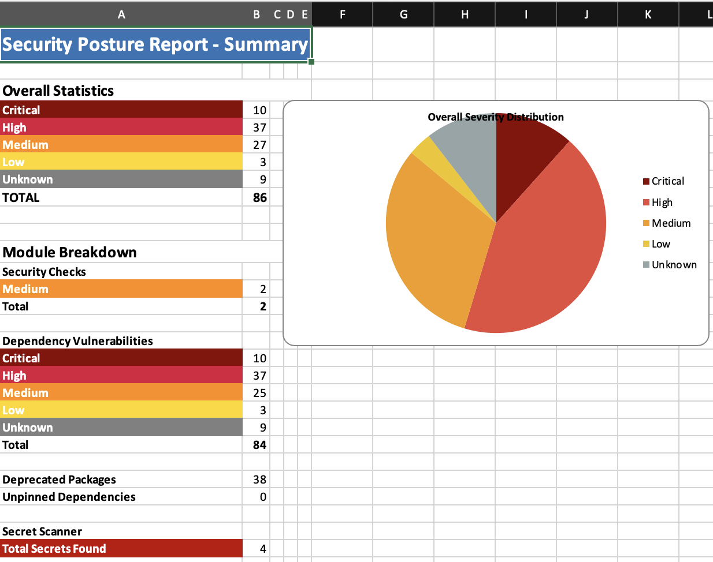
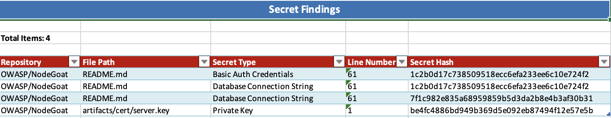
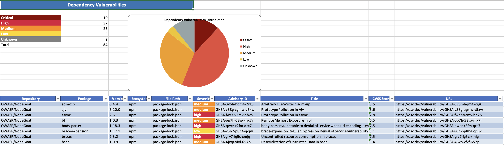
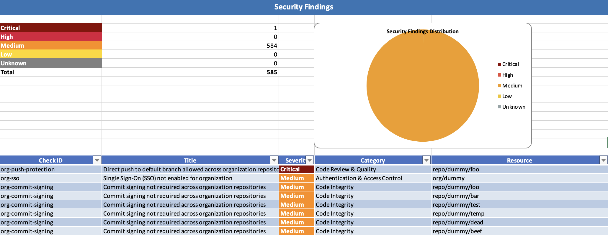

# gitsec

[]()
[]()

A modular Python CLI tool for auditing GitHub security posture at organization and repository level.

## Overview

gitsec helps you secure your GitHub environment at scale. It checks all key security configurations at both organization and repository level, scans for hardcoded secrets and vulnerable, deprecated, or unpinned dependencies, and gives you one comprehensive report with everything you need to fix.

## Features

**gitsec** provides comprehensive security auditing for GitHub repositories and organizations through three main modules:

### 1. Secret Scanning
Detect hardcoded secrets and credentials in your codebase using the `detect-secrets` library with custom plugins.

- API keys (AWS, Google Cloud, Azure, OpenAI, Anthropic, etc.)
- Database connection strings
- Private keys and certificates
- OAuth tokens and webhook secrets

### 2. Dependency Scanning
Identify vulnerabilities in your project dependencies using the deps.dev API.

- Known CVEs and security advisories
- CVSS severity scoring
- Deprecated packages detection
- Unpinned dependencies identification
- Support for multiple ecosystems (npm, pip, Maven, Go, etc.)

### 3. Security Checks
Audit GitHub security configurations at organization and repository level.

**Organization-level checks:**
- MFA requirement status
- SSO/SAML configuration
- Commit signing enforcement
- Pull request requirements
- Push protection
- Tag deletion protection
- Secrets and runners scope
- User access analysis

**Repository-level checks:**
- Commit signing requirements
- Pull request requirements
- Push protection
- Tag deletion protection
- Runners scope

## Installation

### Using pip (recommended)

```bash
pip install gitsec
```

### Using pipx (isolated installation)

```bash
pipx install gitsec
```

### For Development

1. Clone the repository:
```bash
git clone https://github.com/yourusername/gitsec.git
cd gitsec
```

2. Install dependencies:
```bash
poetry install
```

### Authentication

Set your GitHub token:
```bash
export GITHUB_TOKEN=your_github_personal_access_token
```

## Usage

### Quick Start

Run a comprehensive audit on an organization:
```bash
gitsec audit-all --org your-org --out-folder results
```

Run a comprehensive audit on a single repository:
```bash
gitsec audit-all --repo owner/repo --out-folder results
```

### Comprehensive Audit

The `audit-all` command runs all three security modules and generates a single Excel report.

```bash
# Organization
gitsec audit-all --org myorg

# Single repository
gitsec audit-all --repo owner/repo

# Local repository
gitsec audit-all --local-repo /path/to/repo

# GitHub Enterprise Server
gitsec audit-all --org myorg --base-url https://github.mycorp.com
```

**Output:** Single Excel file (`audit_all_<target>.xlsx`) with all findings and a combined summary sheet.

**Note:** Security checks are not available for local repositories.

### Secret Scanning

```bash
# Single repository
gitsec scan-secrets --repo owner/repo

# Organization
gitsec scan-secrets --org myorg

# Local repository
gitsec scan-secrets --local-repo /path/to/repo

# Choose output format (csv, xls, or csv,xls)
gitsec scan-secrets --repo owner/repo --format csv,xls --out-folder reports
```

### Dependency Scanning

```bash
# Single repository
gitsec scan-dependencies --repo owner/repo

# Organization
gitsec scan-dependencies --org myorg

# Local repository
gitsec scan-dependencies --local-repo /path/to/repo

# Choose output format (csv, xls, or csv,xls)
gitsec scan-dependencies --repo owner/repo --format xls
```

### Security Checks

Run all checks or specific modules:

```bash
# All organization-level checks
gitsec security-checks all-org --org myorg

# All repository-level checks
gitsec security-checks all-repo --repo owner/repo

# Specific checks (can combine multiple)
gitsec security-checks org-mfa org-sso --org myorg
gitsec security-checks repo-commit-signing repo-pr-required --repo owner/repo
```

## Available Security Check Modules

### Organization-level
- `org-mfa` - Check if MFA is required for all organization members
- `org-sso` - Check if SSO/SAML is configured
- `org-commit-signing` - Check commit signing enforcement across all repositories
- `org-pr-required` - Check PR requirements across all repositories
- `org-push-protection` - Check push protection across all repositories
- `org-tag-deletion-protection` - Check tag deletion protection across all repositories
- `org-secrets-scope` - Audit organization secrets visibility and scope
- `org-runners-scope` - Audit self-hosted runners scope and visibility
- `org-user-access` - Analyze user access patterns and permissions

### Repository-level
- `repo-commit-signing` - Check if commit signing is required
- `repo-pr-required` - Check if PRs are required on default branch
- `repo-push-protection` - Check if direct pushes to default branch are blocked
- `repo-tag-deletion-protection` - Check if tag deletion is protected
- `repo-runners-scope` - Audit self-hosted runners scope

## Output

All commands generate reports in the specified output directory:

- **CSV format:** Individual CSV files for each finding type
- **Excel format:** Comprehensive Excel workbook with multiple sheets and summary
- **Combined format:** Both CSV and Excel (use `--format csv,xls`)

The `audit-all` command generates a single Excel file containing all findings with a summary sheet.

### Example Reports

Here's some examples of what the output looks like:

**Summary Overview:**


**Secret Scanning Results:**


**Dependency Vulnerabilities:**


**Security Checks:**


## GitHub Enterprise Server Support

All commands support GitHub Enterprise Server via the `--base-url` flag:

```bash
gitsec audit-all --org myorg --base-url https://github.mycorp.com
```

## Token Permissions

The GitHub personal access token requires the following scopes:

- `repo` - Full control of private repositories
- `read:org` - Read organization data
- `admin:org` - Read organization security settings

For GitHub Enterprise Server, ensure the token has equivalent permissions.

## License

MIT

## Contributing

Contributions are welcome! Please feel free to submit a Pull Request.
