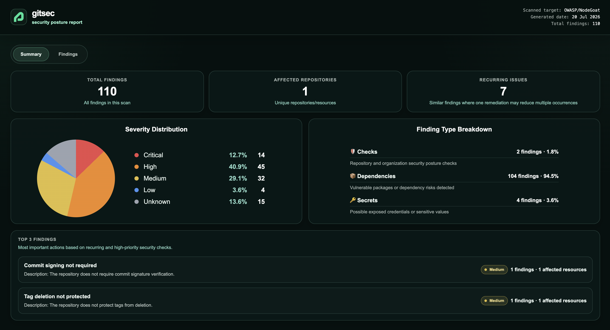
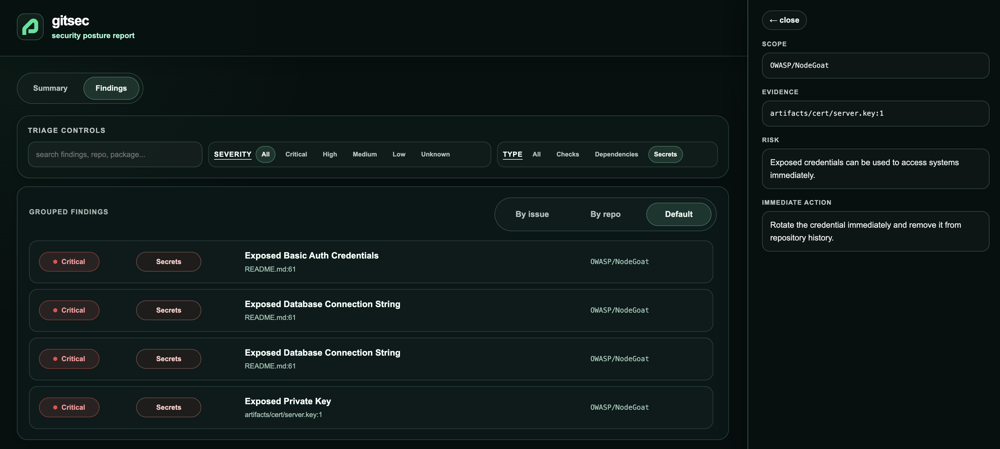
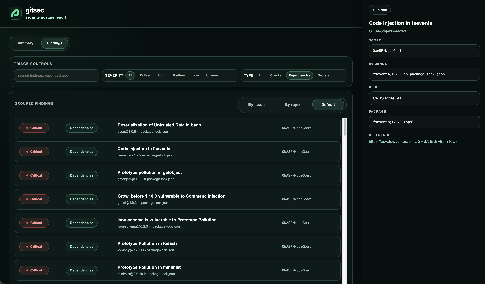
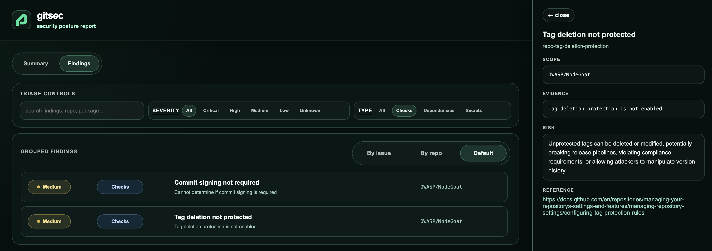

# gitsec

[]()
[]()

**gitsec** is a modular Python CLI tool for auditing GitHub security posture at organization, repository, and local repository level.

It helps security and engineering teams review GitHub configuration, detect hardcoded secrets, identify dependency risks, and generate reports in **HTML**, **SARIF**, or **CSV** format.

---

## Overview

gitsec brings multiple GitHub security checks into one CLI workflow. It can scan repositories and organizations, collect findings from different security modules, and produce structured reports for review and remediation.

The tool focuses on three core areas:

- **Secret scanning** — detects hardcoded credentials and sensitive values.
- **Dependency scanning** — identifies vulnerable, deprecated, or unpinned dependencies.
- **Security checks** — audits GitHub organization and repository security settings.

---

## Features

- Audit GitHub organizations and individual repositories
- Scan local repositories for secrets and dependency risks
- Detect hardcoded secrets using `detect-secrets`
- Identify dependency vulnerabilities using the deps.dev API
- Review GitHub organization and repository security settings
- Generate HTML reports for human review
- Export SARIF for SARIF-compatible security tooling
- Export CSV for lightweight analysis or post-processing
- Support GitHub Enterprise Server using `--base-url`
- Support configuration files for repeatable scans

---

## Security Modules

### Secret Scanning

Secret scanning detects hardcoded credentials and sensitive values in the codebase.

Examples include:

- API keys
- Cloud provider credentials
- Database connection strings
- Private keys and certificates
- OAuth tokens and webhook secrets

### Dependency Scanning

Dependency scanning identifies package and dependency risks using the deps.dev API.

It can detect:

- Known CVEs and security advisories
- CVSS severity scores
- Deprecated packages
- Unpinned dependencies
- Multiple ecosystems such as npm, pip, Maven, and Go

### Security Checks

Security checks audit GitHub security configuration at organization and repository level.

**Organization-level checks:**

- `org-mfa` — MFA requirement for organization members
- `org-sso` — SSO/SAML configuration
- `org-default-repo-permission` — default repository permissions
- `org-members-can-create-repos` — member repository creation permissions
- `org-commit-signing` — commit signing enforcement
- `org-pr-required` — pull request requirements
- `org-push-protection` — push protection
- `org-tag-deletion-protection` — tag deletion protection
- `org-secrets-scope` — organization secrets visibility and scope
- `org-runners-scope` — self-hosted runners scope and visibility
- `org-user-access` — user access patterns and permissions

**Repository-level checks:**

- `repo-commit-signing` — commit signing requirement
- `repo-pr-required` — pull request requirement on default branch
- `repo-push-protection` — direct push protection on default branch
- `repo-tag-deletion-protection` — tag deletion protection
- `repo-runners-scope` — self-hosted runners scope

> Security checks require GitHub API access and are not available for local repositories.

---

## Output Formats

gitsec supports the following report formats:

| Format | Description |
|---|---|
| **HTML** | Interactive report for reviewing scan summaries and detailed findings |
| **SARIF** | Standard JSON-based format for SARIF-compatible security tools |
| **CSV** | Lightweight tabular output for analysis or post-processing |

Example:

```bash
gitsec audit-all --repo owner/repo --format html --out-folder reports
gitsec audit-all --repo owner/repo --format sarif --out-folder reports
gitsec audit-all --repo owner/repo --format html,sarif --out-folder reports
```

---

## HTML Report

The HTML report provides an interactive view of GitSec results, making it easier to review scan summaries and investigate detailed findings.

- A summary view for the overall scan result
- Severity and finding type breakdowns
- Affected repository and duplicate finding summaries
- Recommended actions for recurring or high-priority findings
- A findings view with search, filtering, grouping, and detailed finding information

The summary view is intended for quick review, while the findings view is used for investigation and remediation.

---

## Example Reports

Here are examples of the HTML report views.

**Summary Overview**



**Secret Scanning Results**



**Dependency Vulnerabilities**



**Security Checks**



---

## Installation

### Using pip

```bash
pip install gitsec
```

### Using pipx

```bash
pipx install gitsec
```

### For development

```bash
git clone https://github.com/yourusername/gitsec.git
cd gitsec
poetry install
```

---

## Authentication

Set a GitHub personal access token before running GitHub organization or repository scans:

```bash
export GITHUB_TOKEN=your_github_personal_access_token
```

Required token access depends on the checks you run.

Recommended scopes for classic tokens:

- `repo` — access repository data
- `read:org` — read organization data
- `admin:org` — read organization security settings

For GitHub Enterprise Server, make sure the token has equivalent permissions.

---

## Quick Start

Run a full audit on an organization:

```bash
gitsec audit-all --org your-org --format html --out-folder results
```

Run a full audit on a single repository:

```bash
gitsec audit-all --repo owner/repo --format html --out-folder results
```

Run a local repository scan:

```bash
gitsec audit-all --local-repo /path/to/repo --format html --out-folder results
```

---

## Usage

### Comprehensive Audit

The `audit-all` command runs secret scanning, dependency scanning, and GitHub security checks where applicable.

```bash
# Organization
gitsec audit-all --org myorg --format html

# Single repository
gitsec audit-all --repo owner/repo --format html

# Single repository with custom branch
gitsec audit-all --repo owner/repo --branch develop --format html

# Local repository
gitsec audit-all --local-repo /path/to/repo --format html

# GitHub Enterprise Server
gitsec audit-all --org myorg --base-url https://github.mycorp.com --format html
```

### Secret Scanning

```bash
gitsec scan-secrets --repo owner/repo --format html
gitsec scan-secrets --org myorg --format html
gitsec scan-secrets --local-repo /path/to/repo --format csv
```

### Dependency Scanning

```bash
gitsec scan-dependencies --repo owner/repo --format html
gitsec scan-dependencies --org myorg --format sarif
gitsec scan-dependencies --local-repo /path/to/repo --format csv
```

### Security Checks

```bash
gitsec security-checks all-org --org myorg
gitsec security-checks all-repo --repo owner/repo
gitsec security-checks org-mfa org-sso --org myorg
gitsec security-checks repo-commit-signing repo-pr-required --repo owner/repo
```

---

## Configuration File

gitsec supports configuration files for repeatable scans and shared scan settings.

The tool discovers configuration files in this order:

1. `.gitsec.yml` or `gitsec.yml` in the current directory
2. `.gitsec.yml` in the home directory
3. Custom path through `--config`

Configuration files can define:

- Default targets
- Output folder
- Repository include/exclude filters
- Enabled or disabled scan modules
- Branch overrides for specific repositories

Example:

```yaml
target:
  org: my-organization

output_folder: audit-results

repositories:
  include:
    - "frontend-*"
    - "backend-api"
  exclude:
    - "*-archive"
    - "*-deprecated"
  max_count: 50
  sort_by: pushed_at

security_checks:
  enabled_modules:
    - org-mfa
    - org-sso
    - org-commit-signing

repository_overrides:
  frontend-app:
    branch: develop
    enabled_modules:
      - repo-commit-signing
      - repo-pr-required
```

CLI arguments always take precedence over configuration file settings.

For a complete sample configuration file, see `examples/gitsec.example.yml`.

---

## GitHub Enterprise Server Support

All GitHub-based commands support GitHub Enterprise Server through the `--base-url` flag:

```bash
gitsec audit-all --org myorg --base-url https://github.mycorp.com --format html
```

---

## Performance

gitsec caches API responses during command execution to reduce redundant requests and avoid rate limits.

---

## Contributing

Contributions are welcome. Please feel free to submit a pull request.

---

## License

MIT